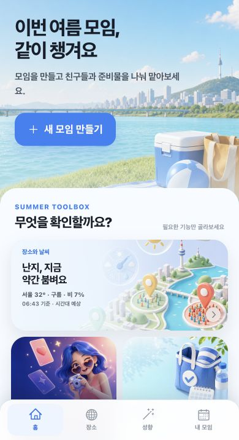
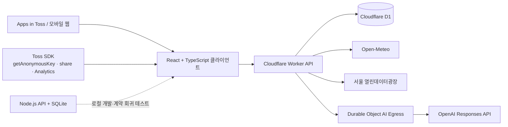

# 챙겨썸

> 날씨·혼잡도·친구들의 준비 상태를 한곳에 모아, 여름 약속의 준비 부담을 함께 나누는 Apps in Toss 미니앱

<p align="center">
  
</p>

<p align="center">
  <a href="https://minion.toss.im/FfgBn2o8"><strong>Apps in Toss에서 실행</strong></a>
  ·
  <a href="https://chaengyeosum-mobile.khyun97.chatgpt.site"><strong>라이브 데모</strong></a>
  ·
  <a href="./SUBMISSION.md">챌린지 출품 문서</a>
  ·
  <a href="./DEPLOYMENT.md">배포 문서</a>
  ·
  <a href="./RELEASE-CHECKLIST.md">출시 체크리스트</a>
</p>

<p align="center">
  
  
  
  
  
</p>

---

## 프로젝트 소개

여름 모임은 장소를 정하는 순간보다 그 이후가 더 번거롭습니다. 날씨를 확인하고, 준비물을 정하고, 친구마다 담당을 나누고, 출발 직전 빠진 물건이 없는지 다시 확인해야 합니다.

챙겨썸은 이 과정을 **공동 체크리스트 기반의 가벼운 협업 경험**으로 바꿉니다. 모임을 만들면 장소·날씨·인원에 맞는 준비물을 추천하고, 초대받은 친구들은 설치 없이 하나씩 맡아 준비 상태를 함께 완성할 수 있습니다.

| 구분 | 내용 |
|---|---|
| 프로젝트 유형 | 개인 프로젝트 · Apps in Toss 바이브코딩 챌린지 출품작 |
| 담당 범위 | 제품 기획, UX/UI, 프론트엔드, API·DB, AI 기능, 배포, QA |
| 플랫폼 | Apps in Toss WebView · 모바일 웹 |
| 운영 환경 | Cloudflare Workers + D1 · ChatGPT Sites |
| 현재 버전 | `0.1.5` |

## 해결하려는 문제

기존 메신저 중심의 모임 준비에는 세 가지 문제가 있습니다.

1. **정보가 흩어집니다.** 날씨, 장소, 준비물과 담당자가 여러 대화에 섞입니다.
2. **책임이 모호합니다.** 누가 무엇을 챙기는지, 실제로 준비했는지 확인하기 어렵습니다.
3. **출발 직전에 다시 점검합니다.** 장소 상황과 날씨가 달라지면 준비물을 처음부터 확인해야 합니다.

챙겨썸은 모임 맥락을 분석해 준비물을 먼저 제안하고, 담당과 완료 상태를 실시간으로 공유하며, 출발 전에는 지금 필요한 행동만 짧게 보여줍니다.

## 핵심 경험

| 경험 | 구현 내용 | 사용자 가치 |
|---|---|---|
| 스마트 준비물 | 장소·활동·날씨·인원 기반 추천과 수량 계산 | 무엇을 챙길지 고민하는 시간 단축 |
| 함께 준비하기 | 초대 참여, 하나 맡기, 랜덤 배정, 공동 체크 | 준비 책임을 자연스럽게 분담 |
| 장소 인텔리전스 | 서울 공식 실시간 인구 또는 근거가 표시된 예상 혼잡도 | 덜 붐비는 시간과 장소 선택 |
| AI 출발 브리핑 | 팀 별명, 핵심 빈틈, 즉시 할 일, 공유 문구 생성 | 출발 직전 복잡한 상태를 한 번에 요약 |
| 재방문과 공유 | 진행률 카드, 활동 피드, 응원 반응, 성향 캐릭터와 친구 조합 | 다시 들어오고 친구에게 보내고 싶은 동기 형성 |
| 사용자 복구 | Apps in Toss `getAnonymousKey` 기반 내 모임 자동 복구 | 저장소가 초기화돼도 같은 토스 사용자 데이터 연결 |

<p align="center">
  
</p>

## 차별화 포인트

### 1. 체크리스트를 넘어선 상황 인식

정적인 준비물 목록이 아니라 실제 예보, 장소 특성, 자외선, 강수 확률과 예상 인원을 함께 분석합니다. 예를 들어 폭염에는 물과 휴대용 선풍기 수량을 늘리고, 비 예보에는 우산과 방수팩을 우선 추천합니다.

### 2. 공식 데이터와 추정 데이터를 구분

한강 등 서울시 지원 장소는 서울 열린데이터광장의 실시간 인구 데이터를 사용합니다. 지원 범위 밖에서는 요일·시간·계절·장소 인기도를 조합한 참고값을 제공하되, UI에서 **공식 혼잡도**와 **예상 혼잡도**를 명확히 구분합니다.

### 3. AI를 장식이 아닌 행동으로 연결

AI 브리핑은 긴 설명을 생성하는 대신 현재 빠진 준비와 즉시 할 일을 구조화합니다. 추천 준비물을 누르면 실제 체크리스트 항목으로 이동하며, 같은 준비 상태에서는 결과를 재사용해 비용과 대기 시간을 줄입니다.

### 4. 로그인 없는 사용자 복구

Apps in Toss의 `getAnonymousKey`를 참여자와 연결해 별도 회원가입 없이 내 모임을 복구합니다. 원본 식별키와 참여 토큰은 DB에 저장하지 않고 SHA-256 해시만 보관합니다. 일반 브라우저에서는 로컬 참여 토큰 방식으로 안전하게 폴백합니다.

## 시스템 아키텍처



### 데이터 흐름

1. 클라이언트가 모임 생성·참여·준비 상태 변경 요청을 Worker로 전송합니다.
2. Worker는 참여 토큰 또는 해시 처리된 익명 사용자 키로 권한을 확인합니다.
3. 공동 상태는 D1에 저장되고 클라이언트가 2.5초 간격으로 동기화합니다.
4. 날씨·혼잡·행사 정보는 출처별 캐시 정책을 거쳐 모임 데이터와 결합됩니다.
5. AI 호출은 사용자가 요청할 때만 실행하며 참가자 이름은 모델에 전송하지 않습니다.

## 주요 기술적 의사결정

### Cloudflare Workers + D1

- 초기 미니앱 트래픽에서 유휴 서버 비용을 최소화하기 위해 서버리스 구성을 선택했습니다.
- Worker와 D1을 같은 플랫폼에서 운영해 배포 단계를 단순화했습니다.
- Node.js + SQLite 구현을 별도로 유지해 빠른 로컬 개발과 API 계약 회귀 테스트에 활용합니다.

### 캐시와 비용 방어

| 데이터 | 정책 |
|---|---|
| 날씨 | 30분 캐시 |
| AI 브리핑 | 준비 상태 지문별 12시간 재사용 · 모임별 24시간 8회 |
| 여름 행사 검색 | 6시간 캐시 · 모임별 24시간 3회 |
| 공동 준비 상태 | 2.5초 폴링 |

### 개인정보와 권한

- 참여 토큰과 토스 익명 식별키는 원문 대신 SHA-256 해시로 저장합니다.
- 모임 조회에는 참여 토큰, 익명 사용자 키 또는 유효한 초대 코드가 필요합니다.
- 생성자만 모임을 삭제할 수 있고, 참여자만 준비 상태를 변경할 수 있습니다.
- OpenAI 요청에서 참가자 이름을 제외하고 `store: false`를 사용합니다.
- 요청 본문은 32KB로 제한하고 모든 운영 통신은 HTTPS를 사용합니다.

## 기술 스택

| 영역 | 기술 |
|---|---|
| Miniapp | Apps in Toss Web Framework `2.10.8` |
| Frontend | React 19, TypeScript, Vite, CSS |
| App SDK | `getAnonymousKey`, `getTossShareLink`, `share`, `Analytics` |
| API | Cloudflare Workers, Node.js |
| Database | Cloudflare D1, SQLite |
| AI | OpenAI Responses API, strict JSON Schema, Durable Objects |
| External data | Open-Meteo, 서울 열린데이터광장 |
| Hosting | ChatGPT Sites, Cloudflare Workers |
| Testing | Node Test Runner, Worker smoke test, 정적 출시 검사 |

## 품질 검증

현재 릴리스 기준으로 다음 검사를 자동화했습니다.

- TypeScript 타입 검사
- API 계약·도메인 테스트 **16개**
- Cloudflare Worker 운영 스모크 테스트
- 비게임 미니앱 출시 정적 점검 **18개**
- AIT 번들 크기 검사: 약 **9.1MB / 100MB 이하**
- Android WebView 하단 안전영역, 네이티브 뒤로가기, 입력 포커스 회귀 검사

```bash
npm run typecheck
npm run test:api
npm run build:web
npm run check:release
```

## 로컬 실행

### 요구 환경

- Node.js 22 이상
- npm

### 실행

```bash
git clone https://github.com/kwakhyun/chaengyeosum.git
cd chaengyeosum
npm ci
npm run dev
```

| 서비스 | 주소 |
|---|---|
| Web | `http://localhost:5173` |
| Local API | `http://localhost:8787` |
| SQLite | `server/.data/chaengyeosum.sqlite` |

웹과 API를 따로 실행하려면 `npm run dev:web`, `npm run dev:api`를 사용합니다.

## 환경 변수

운영 키는 클라이언트 번들이나 저장소에 포함하지 않고 Cloudflare Worker secret으로 관리합니다.

```bash
npx wrangler secret put OPENAI_API_KEY
npx wrangler secret put SEOUL_OPEN_DATA_API_KEY
```

| 변수 | 필수 여부 | 용도 |
|---|---|---|
| `OPENAI_API_KEY` | AI 기능 사용 시 필수 | 출발 전 브리핑과 검증된 여름 행사 검색 |
| `SEOUL_OPEN_DATA_API_KEY` | 선택 | 서울시 지원 장소의 공식 실시간 혼잡 정보 |
| `VITE_API_BASE_URL` | 선택 | 클라이언트가 사용할 API 주소 재정의 |
| `VITE_TOSS_USER_DATA_KEY` | 이름 자동 입력 시 필수 | 콘솔의 ‘유저정보 불러오기’에서 이름 항목으로 발급받은 `cud_` 키 |

`VITE_TOSS_USER_DATA_KEY`는 비밀키가 아니라 클라이언트 SDK가 동의문을 찾는 식별자입니다. 이름은 토스의 개인정보 제3자 제공 동의가 완료된 경우에만 현재 세션에서 사용하며, 동의 취소·미지원 환경에서는 기존 직접 입력 UI를 유지합니다.

키가 없거나 외부 API가 지원하지 않는 장소에서는 핵심 모임·준비 기능이 유지되고, 해당 기능만 폴백 데이터 또는 안내 상태로 전환됩니다.

## 빌드와 배포

### Apps in Toss 번들

```bash
npm run build
```

성공하면 프로젝트 루트에 `chaengyeosum.ait`가 생성됩니다.

### Worker + D1

```bash
npm run db:migrate:remote
npm run deploy:worker
WORKER_API_URL=https://chaengyeosum-api.kwakhyun-miniapps.workers.dev \
  npm run test:worker
```

세부 배포 절차와 비용 판단은 [`DEPLOYMENT.md`](./DEPLOYMENT.md)를 참고하세요.

## 프로젝트 구조

```text
.
├── src/                  # React 화면, 컴포넌트, Toss SDK 연동
├── server/               # Node.js API, 도메인 로직, SQLite, 테스트
├── worker/               # Cloudflare Worker 운영 API와 스모크 테스트
├── migrations/           # D1 마이그레이션
├── site-hosting/         # 공개 모바일 웹 배포 프로젝트
├── public/assets/        # 앱 아이콘과 UI 이미지
├── scripts/              # 출시 정적 검사
├── granite.config.ts     # Apps in Toss 번들 설정
└── wrangler.toml         # Worker·D1·Durable Object 설정
```

## 설계상 한계와 다음 단계

- 앱인토스 푸시 알림은 콘솔 템플릿과 발송 서버 연결 후 D-1 리마인드에 적용할 예정입니다.
- 실제 토스 앱 완전 종료·재설치 조건에서 익명 사용자 복구 테스트를 추가할 예정입니다.
- 트래픽 증가에 대비해 일반 API 단위 요청 제한과 D1 백업·보존 정책을 보강할 예정입니다.

---

챙겨썸은 기능 수를 늘리는 것보다 **친구들과 여름 약속을 준비하는 과정에서 실제로 다음 행동이 쉬워지는가**를 기준으로 제품과 기술을 설계했습니다.
