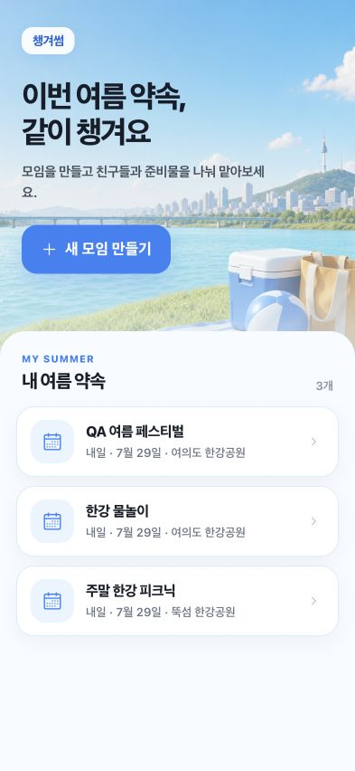
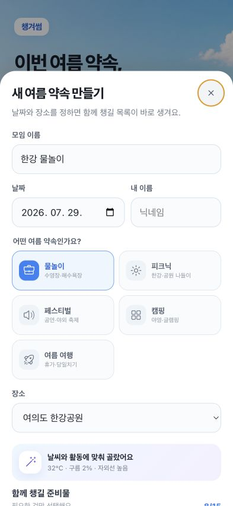
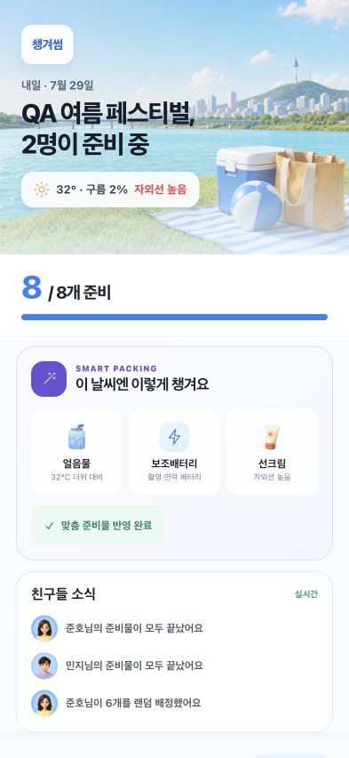
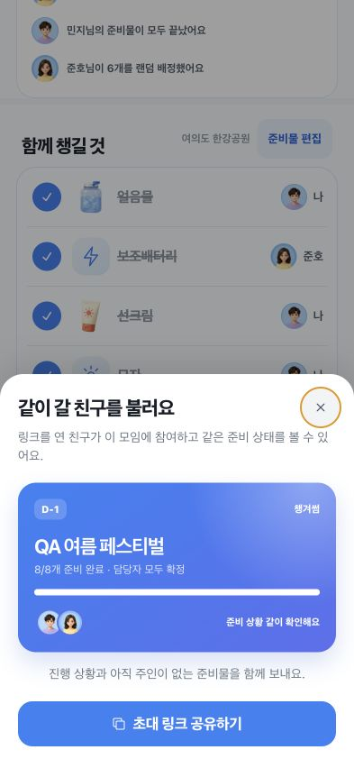

# 챙겨썸 제출 준비도 감사 — 2026-07-28

## 범위

- 사용자 목표: 여름 모임을 만들고, 준비물을 추천받아 친구와 나눠 맡고 공유하기
- 감사 범위: 홈 → 스마트 모임 생성 → 공동 준비 완료 → 진행률 공유
- 확인 환경: 393 × 852 모바일 뷰포트, 로컬 WebView 프런트엔드와 실제 로컬 API

## 화면별 상태

### 1. 홈 — 양호

- 첫 행동인 `새 모임 만들기`가 명확하다.
- 최근 모임은 날짜와 장소를 제공하지만 진행률이나 미완료 상태는 없다.
- 재방문 시 “어느 모임에 지금 행동해야 하는지”를 보여주는 정보가 부족하다.

### 2. 스마트 모임 생성 — 양호

- 활동 유형과 날씨 추천이 하나의 흐름으로 이해된다.
- 추천 이유가 제공돼 자동 선택에 대한 신뢰가 있다.
- 준비물 18개가 길게 이어져 하단 제출 버튼까지 스크롤 거리가 길다.
- 추천 항목/전체 항목 접기 또는 “추천만 보기”는 향후 개선 후보이다.

### 3. 공동 준비 완료 — 매우 양호

- 날씨, 진행률, 친구 활동이 한 화면에서 자연스럽게 연결된다.
- 8/8 상태와 친구 소식이 공동 준비의 재미를 만든다.
- 라이브 리전, 키보드 포커스, 스크린 리더 읽기 순서는 실제 기기 검증이 더 필요하다.

### 4. 진행률 공유 — 매우 양호

- D-Day, 준비율, 담당 확정, 참여자 정보가 공유 이유를 만든다.
- 100% 완료 상태에서는 `초대 링크 공유하기`보다 `준비 완료 공유하기`가 문맥상 더 정확하다.

## 확인된 강점

- 콘솔 오류 0건
- 가로 오버플로 0px
- 표시 중인 버튼 가운데 40px 미만 터치 영역 0개
- 제목 구조는 H1 → H2 → H3 순서로 구성됨

## 제출 차단 항목

1. 프로덕션 번들 API 주소가 `/api`로 고정돼 있어 배포 API 없이는 실제 앱에서 핵심 기능이 실패한다.
2. `granite.config.ts`의 `brand.icon`이 비어 있다.
3. 현재 앱 아이콘은 1024 × 1024이며 자체 둥근 모서리를 포함해 600 × 600 전체 배경 로고 가이드에 맞지 않는다.
4. `index.html`의 viewport에 `maximum-scale=1, user-scalable=no`가 없다.
5. 현재 `.ait`는 위 설정을 반영하지 않은 번들이므로 제출 최종본으로 사용하면 안 된다.

## 권장 우선순위

- P0: API 배포 → CORS 설정 → 프로덕션 API 주소 주입 → 로고/아이콘 URL 적용 → viewport 수정 → 재빌드
- P0: 토스앱 QR 환경에서 생성·초대·참여·공유·뒤로가기 실제 기기 확인
- P0: 콘솔 appName과 `chaengyeosum`, 딥링크 `intoss://chaengyeosum/...` 일치 확인
- P1: 1932 × 828 썸네일과 636 × 1048 세로 스크린샷 3장 준비
- P1: 앱 부제·상세 설명·고객센터·카테고리·개인정보 처리방침 입력
- P1: 전환 지표 `outing_created → outing_invite_shared → outing_joined → packing_item_self_claimed` 설정
- P2: 홈 모임 카드에 진행률·미배정 수 표시
- P2: D-1 푸시와 참가 인원 기반 준비물 수량 추천

## 증거 한계

- 앱인토스 콘솔의 실제 appName, 앱 정보 승인 상태, 아이콘 URL, 번들 업로드 상태는 확인하지 못했다.
- 실제 토스앱의 공통 내비게이션 바, 딥링크, 백 버튼, 공유 시트, 네트워크 CORS는 로컬 브라우저 스크린샷만으로 확인할 수 없다.
- 스크린샷 감사는 전체 WCAG 준수를 증명하지 않는다.
